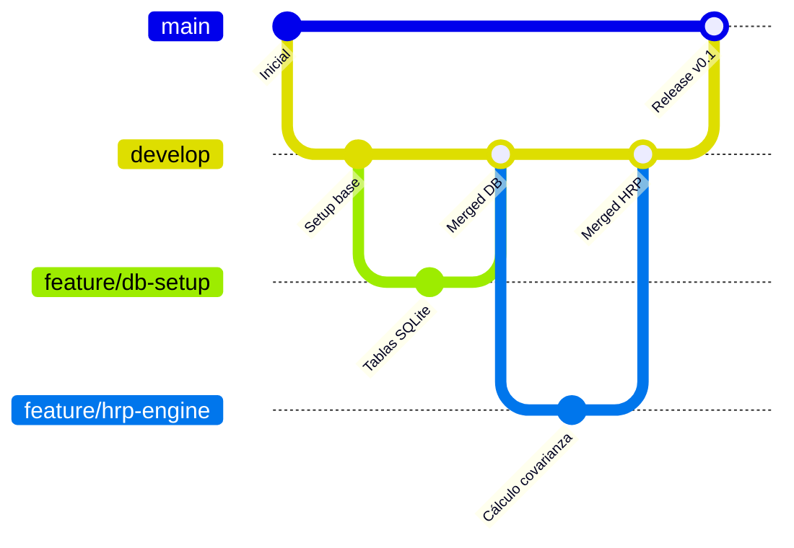

# Guía Rápida de Git y Políticas de Ramas

Esta guía describe el flujo de trabajo colaborativo con Git para el proyecto **Dashboard Financiero**. El objetivo es mantener la estabilidad del código, asegurar la calidad del producto y facilitar la integración coordinada de los 7 miembros del equipo.

---

## 1. El Modelo de Ramas (Git Flow Simplificado)

El proyecto se organiza bajo una jerarquía estricta de ramas para proteger el código que va a producción.



### Ramas Permanentes
*   **`main`**: Contiene únicamente el código estable, testeado y listo para entrega. **Bloqueada para escritura directa** local y remotamente.
*   **`develop`**: Rama principal de integración diaria. Aquí convergen las características completadas antes de ser enviadas a `main`.

### Ramas Temporales (`feature/*`)
Para cada tarea o fase asignada, el desarrollador trabaja en su propia rama de características partiendo siempre de `develop`.  Por ejemplo:

*   `feature/db-setup` (Base de datosSQLite y precargas)
*   `feature/hrp-engine` (Motor matemático HRP y Yahoo Client)
*   `feature/streamlit-ui` (Tableros visuales y controles)
*   `feature/pdf-api` (Endpoints FastAPI y exportación de reportes)
*   `feature/test-suite` (Baterías de pruebas en Pytest)
*   `feature/docs-memory` (Redacción y formato de la memoria académica)

O los nombres os parezcan bien. Una vez enviado el el Pull Request y fusionado con Develop, la rama de características remota se elimina para mantener limpio el repositorio. Recordad que es temporal.

Para continuar trabajos, incluso sobre el mismo tema, creais una nueva rama y listo.

1. Creación de rama temporal
2. Desarrollo y documentación
3. Commit a la rama temporal
4. Pull Request y fusión con develop
5. El administrador borra la rama temporal una vez fusionada con develop
6. Crear nueva rama para continuar trabajos.

---

## 2. Flujo de Trabajo Paso a Paso

Sigue esta secuencia exacta para cada contribución o ajuste que vayas a realizar:

### Paso A: Sincronizar y Crear la Rama
Antes de programar nada, asegúrate de tener la última versión de `develop`:
```bash
# Cambiar a develop y bajar actualizaciones
git checkout develop
git pull origin develop

# Crear tu rama de características a partir de develop
git checkout -b feature/nombre-de-tu-rama
```

### Paso B: Desarrollo y Commits Limpios
Trabaja en tus archivos y realiza confirmaciones con mensajes claros y descriptivos:
```bash
# Consultar el estado y archivos modificados
git status

# Añadir los cambios al stage
git add ruta/al/archivo.py

# Confirmar con un mensaje claro
git commit -m "feat: agregar cálculo de drawdown máximo en el motor de evolución"
```
> [!NOTE]
> Procura no meter todos tus cambios de días en un solo commit gigante. Prefiere commits pequeños que resuelvan una sola cosa a la vez.

### Paso C: Mantenerse Actualizado con `develop`
Si otros compañeros han integrado cambios a `develop` mientras tú programabas en tu rama, intégralos para evitar conflictos futuros:
```bash
git checkout develop
git pull origin develop
git checkout feature/nombre-de-tu-rama
git merge develop
```
*Resuelve los conflictos de archivos si los hubiera, ejecuta las pruebas locales con `uv run pytest` para verificar que nada se ha roto, y confirma el merge.*

### Paso D: Subida y Creación del Pull Request (PR)
Una vez tu código esté completo y todos los tests locales pasen:
```bash
# Subir la rama local al repositorio remoto
git push origin feature/nombre-de-tu-rama
```
1.  Entra en la interfaz web de GitHub del repositorio.
2.  Abre un **Pull Request (PR)** desde tu rama `feature/nombre-de-tu-rama` apuntando hacia `develop`.
3.  Asigna la revisión a la Release Manager (**Diana Valencia**).

---

## 3. Revisión, Aprobación e Integración

> [!IMPORTANT]
> **Ningún desarrollador integra su propio código a `develop`.**

1.  La Release Manager verifica el PR.
2.  Se comprueba que la suite de pruebas pase al 100% (`uv run pytest`).
3.  Una vez aprobado, el PR se fusiona en `develop` y la rama de características remota se elimina para mantener limpio el repositorio.
4.  Al final de cada fase importante, la Release Manager realiza un Merge de `develop` a `main` para consolidar el release.

---

## 4. Protección y Seguridad de Ramas (Git Hooks)

Para evitar accidentes y escrituras accidentales directas sobre `main`, el proyecto incluye scripts de seguridad (*Git Hooks*) que validan la rama activa antes de permitir commits o envíos locales.

Si intentas hacer commit o push directamente en `main`, la consola mostrará un error controlado y bloqueará la acción:
```text
[ERROR] Commit directo a la rama 'main' prohibido por la política del proyecto. Use una rama 'feature/*'.
[ERROR] Push directo a la rama 'main' prohibido. Debe integrar mediante Pull Request a 'develop'.
```
Para corregir esto si te ocurre por error:
```bash
# Guardar temporalmente tus cambios no confirmados
git stash

# Volver a develop, tirar los últimos cambios y crear tu feature branch
git checkout develop
git pull origin develop
git checkout -b feature/nombre-de-tu-rama

# Recuperar tus cambios stasheados
git stash pop
```
